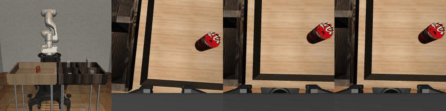
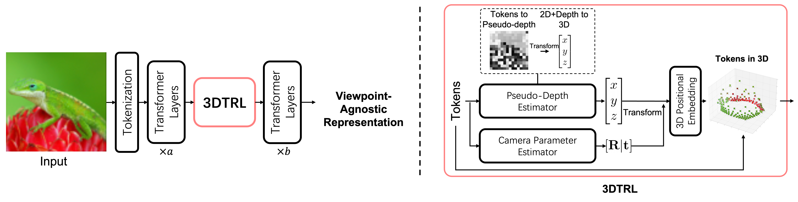

# Learning Viewpoint-Agnostic Visual Representations by Recovering Tokens in 3D Space
by [Jinghuan Shang](https://www3.cs.stonybrook.edu/~jishang/), [Srijan Das](https://srijandas07.github.io/) and [Michael S. Ryoo](http://michaelryoo.com/) at NeurIPS 2022

We present 3DTRL, a plug-and play layer in Transformer using 3D camera transformations to recover tokens in 3D that learns viewpoint-agnostic representations.
Check our [paper](https://arxiv.org/abs/2206.11895) and [project page](https://www3.cs.stonybrook.edu/~jishang/3dtrl/3dtrl.html) for more details.

By 3DTRL, we can align videos from multiple viewpoints, even including ego-centric view and third-person view videos.
| &nbsp; &nbsp; &nbsp; &nbsp; Third-person view &nbsp;	&nbsp; &nbsp; &nbsp;| &nbsp; &nbsp; First-person view GT &nbsp; &nbsp; |   &nbsp; &nbsp; &nbsp; &nbsp; &nbsp; &nbsp; &nbsp; &nbsp; &nbsp; &nbsp;   Ours   &nbsp; &nbsp; &nbsp; &nbsp; &nbsp; &nbsp; &nbsp; &nbsp; &nbsp; &nbsp; &nbsp;  |   &nbsp; &nbsp; &nbsp; &nbsp; &nbsp; &nbsp; &nbsp; &nbsp; &nbsp; DeiT+TCN  &nbsp; &nbsp; &nbsp; &nbsp; &nbsp; &nbsp; |
| ----------------- | -------------------- | ----------- | ----------- |



3DTRL recovers pseudo-depth of images -- getting semantically meaningful results.


Overview of 3DTRL


## Usage

### Directory Structure

```
├── _doc                            # images, gifs, etc for readme
├── action_recognition              # all files related to action recognition go here, this can work stand alone
    ├── configs                     # config files for TimeSformer and +3DTRL
    ├── timesformer
        ├── datasets                # data pipeline for action recognition
        ├── models                  # definitions of TimeSformer and +3DTRL
    ├── script.sh                   # launch script for action recognition
├
├── backbone                        # modules used by 3DTRL (depth and camera estimators)
├── model                           # Transformer models with 3DTRL plug-in (ViT, Swin, TnT)
├── data_pipeline                   # dataset class for video alignment
├── i1k_configs                     # Configuration files for ImageNet-1K training
├
├── 3dtrl_env.yml                   # conda env for image classification and video alignment
├── i1k.sh                          # launch script for ImageNet-1K jobs
├── imagenet_train.py               # entry point of ImageNet-1K training
├── imagenet_val.py                 # entry point of ImageNet-1K evaluation
├── multiview_video_alignment.py    # entry point of video alignment
├── utils.py                        # some utility functions
```

### Image Classification
Environment:
```
conda env create -f 3dtrl_env.yml
```

Run:
```
conda activate 3dtrl
bash i1k.sh num_gpu your_imagenet_dir
```

Credit: We build our code for image classification on top of [timm](https://github.com/rwightman/pytorch-image-models).

### Video Alignment
Dataset:
We release the First-Third Person View (FTPV) dataset (including Pouring, MC, Panda, Lift, and Can used in our paper) at [Google Drive](https://drive.google.com/file/d/14chFXCi74rmd086-QPoAbOcRA-sGcwXn/view?usp=share_link). Download and unzip it.

Environment:
```
conda env create -f 3dtrl_env.yml
```

Run:
```
conda activate 3dtrl
python multiview_video_alignment.py --data dataset_name [--model vit_3dtrl] [--train_videos num_video_used]
```


### Action Recognition
Environment: we follow [TimeSformer](https://github.com/facebookresearch/TimeSformer) to set up the virtual environment. Then,
```
cd action_recognition
bash script.sh your_config_file data_location log_location
```


## Cite 3DTRL
```
@inproceedings{
    3dtrl,
    title={Learning Viewpoint-Agnostic Visual Representations by Recovering Tokens in 3D Space},
    author={Jinghuan Shang and Srijan Das and Michael S Ryoo},
    booktitle={Advances in Neural Information Processing Systems},
    year={2022},
}
```
