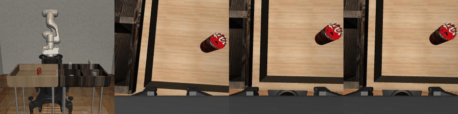
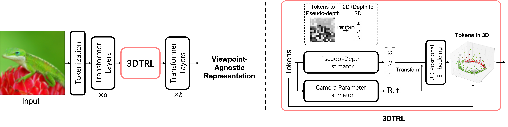

# Learning Viewpoint-Agnostic Visual Representations by Recovering Tokens in 3D Space
by [Jinghuan Shang](https://www3.cs.stonybrook.edu/~jishang/), [Srijan Das](https://srijandas07.github.io/) and [Michael S. Ryoo](http://michaelryoo.com/)

We present 3DTRL, a plug-and play layer in Transformer using 3D camera transformations to recover tokens in 3D that learns viewpoint-agnostic representations.
Check our [pre-print paper]() and [project page](https://www3.cs.stonybrook.edu/~jishang/3dtrl/3dtrl.html) for more details.

By 3DTRL, we can align videos from multiple viewpoints, even including ego-centric view and third-person view videos.

3DTRL recovers pseudo-depth of images -- getting semantically meaningful results.

Overview of 3DTRL

